# Procesverslag
Markdown is een simpele manier om HTML te schrijven.  
Markdown cheat cheet: [Hulp bij het schrijven van Markdown](https://github.com/adam-p/markdown-here/wiki/Markdown-Cheatsheet).

Nb. De standaardstructuur en de spartaanse opmaak van de README.md zijn helemaal prima. Het gaat om de inhoud van je procesverslag. Besteedt de tijd voor pracht en praal aan je website.

Nb. Door *open* toe te voegen aan een *details* element kun je deze standaard open zetten. Fijn om dat steeds voor de relevante stuk(ken) te doen.

## Jij

uitwerken voor kick-off werkgroep

### Auteur:
Jesse de Groot

#### Je startniveau:
Blauw

#### Je focus:
responsive
 

## Je website

uitwerken voor kick-off werkgroep

### Je opdracht:
https://www.rijksmuseum.nl/nl

#### Screenshot(s) van de eerste pagina (small screen): 
home  
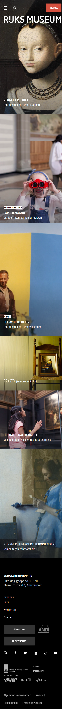

#### Screenshot(s) van de tweede pagina (small screen):
Rijks studio 
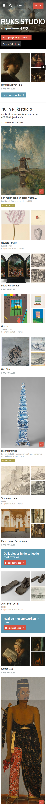

#### Screenshot(s) van de tweede pagina (small screen):
Rijks studio 
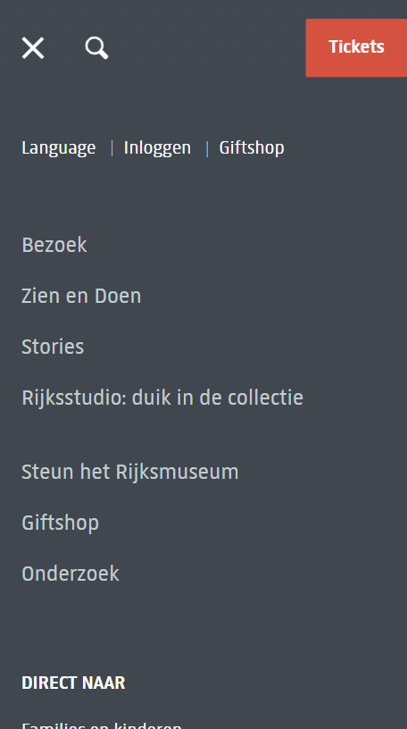

## Breakdownschets (week 1)

uitwerken na afloop 2e werkgroep

### de hele pagina: 
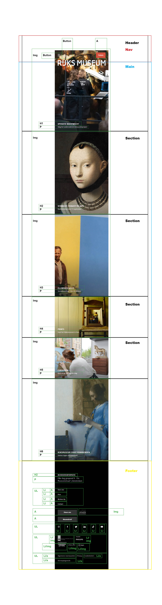

### dynamisch deel (bijv menu): 

### wellicht nog een dynamisch deel (bijv filter): 
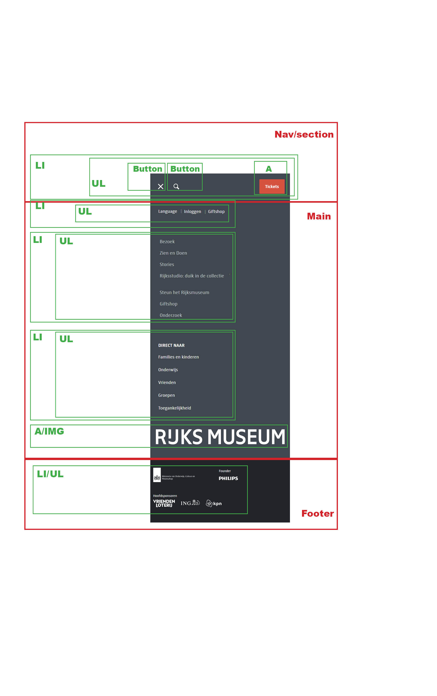

## Voortgang 1 (week 2)

Verder met de website en leren over het element: Position

### Stand van zaken
Deze week hebben wij positioning geoefend, ook ben ik verder gegaan met mijn website. 
Ook ben ik begonnen met het maken van de gallerij pagina.
 
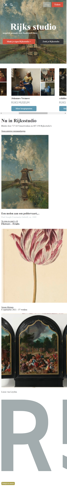

### Agenda voor meeting
samen met je groepje opstellen

| Jesse
| Hoe organiseer ik mijn CSS het best?
| Hoe leer ik over responsive design?
 
Bas; 
-hoe je transitions in css nog spannender kan maken.
-hoe je je code netjes houd

Janice;
-Hoe laat ik om de zoveel tijd een image bewegen?
-Hoe laat ik iets (bijv. een tekst/a) in en uit zoomen als ik eroverheen hover of aanklik.

### Verslag van meeting
hier na afloop snel de uitkomsten van de meeting vastleggen

- Door veel aantekeningen te maken wat je doet op de site
- Daar zal ik nog een week voor moeten wachten. Dan beginnen we met grids en responsive design.

## Voortgang 2 (week 3)

Verder met de website en leren over Grids en animeren

### Stand van zaken
Ik ben verder met de website gegaan en heb de gallerij pagina af (op small screen).

 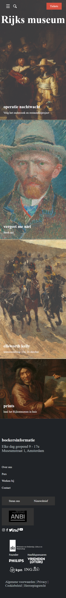
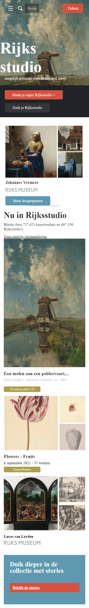
 
### Agenda voor meeting
samen met je groepje opstellen

| Jesse 
| Hoe maak ik de footer hetzelfde als in de https://www.rijksmuseum.nl/nl pagina?
| Wat vind u van mijn css file?

### Verslag van meeting
hier na afloop snel de uitkomsten van de meeting vastleggen

- Ga geen lijsten gebruiken. Het beste is om 5 secties aan te maken, en die te gaan stijlen met flexbox.
- Het is een beetje rommelig, probeer meer comments te schijven bij je code zodat het overzichtelijk blijft. Gebruik ook veel [enter] om ruimte te creeën.

## Toegankelijkheidstest (week 4)

Deze week hebben wij usability testen gedaan bij de fysieke samenkomst..

### Bevindingen
Lijst met je bevindingen die in de test naar voren kwamen:
 - gebruik meer linkjes bij de afbeeldingen
 - Vergeet niet de omschijving toe te voegen bij afbeeldingen
 - let op contrast bij buttons

#### Titel eerste bevinding
gebruik meer linkjes bij de afbeeldingen zodat mensen met de :focus state meer van de site kunnen zien.
Linkjes bedoel ik mee /*  */

#### Titel tweede bevinding. 
vergeet de alt='' niet bij afbeeldingen. schrijf nuttige informatie op zodat mensen die niet kunnen zien wel weten waar de pagina over gaat.

#### Titel volgende bevinding. 
houd het contrast boven 3.5. Dan kunnen mensen die slecht zient zijn ook op de website. Dit kun je zien als je het element inspecteerd. als het onder 3.5 is, staat er een 
rood kruisje bij, als het er boven is, staat er een groene vink.

## Voortgang 3 (week 4)

Ik ben verder gaan werken aan mijn website. De small screens zijn af van index, gallerij en nav. Ook zijn de laatste loodjes van de website. In mijn geval is dat doorwerken

 ### Microinteractie
Stap 1, als je op de nav.html pagina bevind zie je linksboven een zoek knop. Druk daarop:
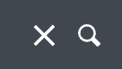
Stap 2, Door javascript code heb ik een popup naar voren laten komen:
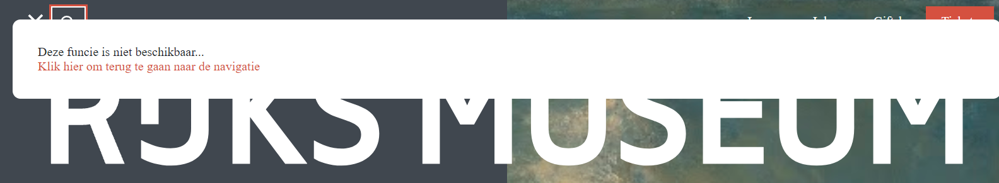
 
 
### Stand van zaken
Het was voor mij behoorlijk lastig omdat ik niet heel veel kennis had van html en css. Daarom heb ik als ik vast liep hulp gevraagd aan de student assistenten. Zij hebben mij met veel geduld en uitleg weten te vertellen hoe ik voor multi-device-design te werk kan gaan.

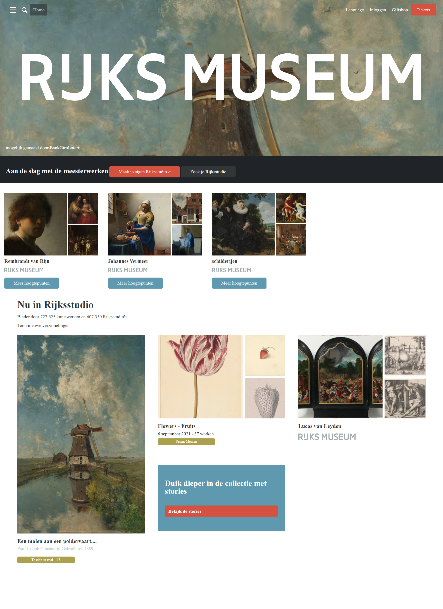
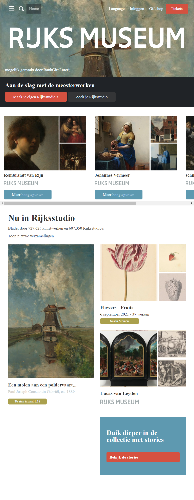
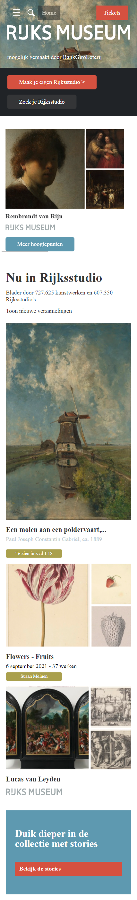

                                                           

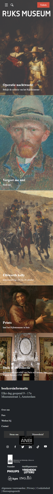

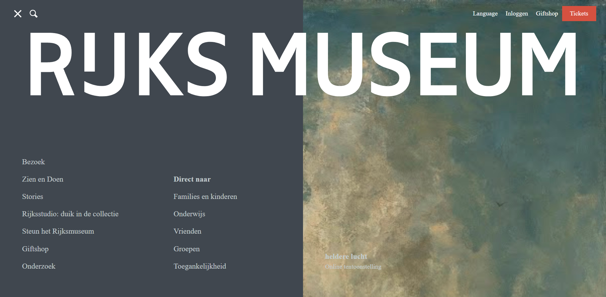
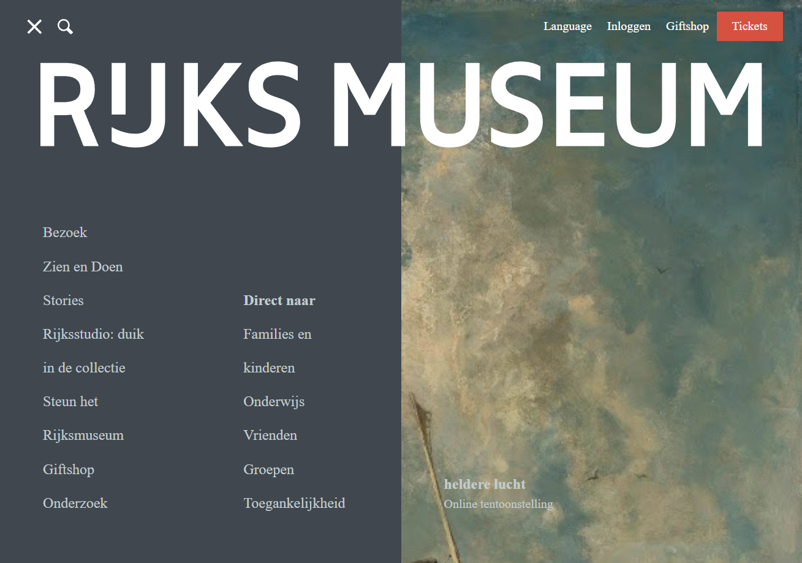
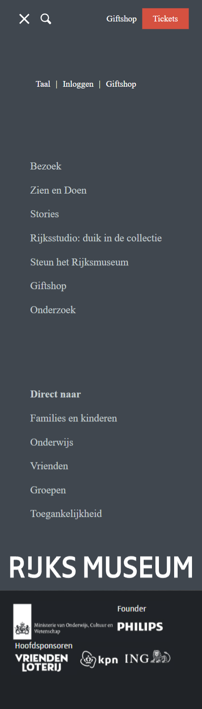

### Agenda voor meeting
samen met je groepje opstellen

| Jesse de Groot
 Hoe kan ik mijn footer stijlen?
 Hoe zorg ik ervoor dat bij gallerij.html, dat de 'home' button aan de linker kant komt en dat language, inloggen en giftshop toegevoegd word aan de rechterkant?

### Verslag van meeting
hier na afloop snel de uitkomsten van de meeting vastleggen

- Hoe ik met grid de footer kan stylen
- hoe ik alleen bij large screen elementen kan toevoegen
 

## Eindgesprek (week 5)

uitwerken voor eindgesprek

### Stand van zaken
hier dit ging goed & dit was lastig (neem ook screenshots op van delen van je website en code)

### Screenshot(s)

hier screenshot(s) van je eindresultaat

## Bronnenlijst

continu bijhouden terwijl je werkt

Nb. Wees specifiek ('css-tricks' als bron is bijv. niet specifiek genoeg).

1. bron 1
2. bron 2
3. ...

